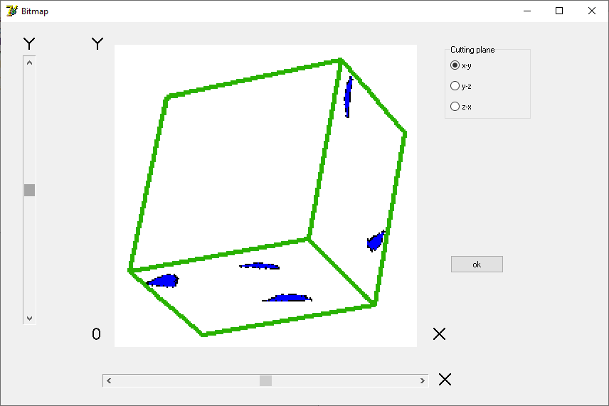

.. _GeoVal_object-reference-label:

====================
GeoVal object types
====================
Different object types available in GeoVal are ``sphere``, ``prism``,
``fibre``, ``platonic_solid``, ``voronoi_polyeder``, ``tube``.

.. literalinclude:: ../examples/examples_geoval.py

The RVE generated for different object types by passing different parameters are shown below.

  
  Sphere
  

  
  Tube
  

  
  Prism
  

  
  Fiber
  

  
  Platonic Solid
  

  
  Voronoi Polyeder

========================================
Effect of changes in shape description parameters
========================================

The images of object type ``sphere`` introduced in ``rve_dims=64`` with different radii are shown below. 
 
.. doctest::

     >>> geo_comm.introduce_objects(N=4, object_type= 'sphere',shape_description={'radius': 10*1.0e-6})

.. doctest::

     >>> geo_comm.introduce_objects(N=4, object_type= 'sphere',shape_description={'radius': 15*1.0e-6})

.. doctest::

     >>> geo_comm.introduce_objects(N=4, object_type= 'sphere',shape_description={'radius': 20*1.0e-6})

.. doctest::

     >>> geo_comm.introduce_objects(N=4, object_type= 'sphere',shape_description={'radius': 25*1.0e-6})

.. doctest::

     >>> geo_comm.introduce_objects(N=4, object_type= 'sphere',shape_description={'radius': 30*1.0e-6})

.. doctest::

     >>> geo_comm.introduce_objects(N=4, object_type= 'sphere',shape_description={'radius': 35*1.0e-6})

  
  

The images of object type ``tube`` introduced in ``rve_dims=64`` with different inner radii, outer radii and length are shown below. 
 
.. doctest::

     >>> geo_comm.introduce_objects(N=4, object_type= 'tube',shape_description={'radius': 10*1e-6, 'length': 15*1.0e-6, 'inner_radius': 5*1.0e-6})

.. doctest::

     >>> geo_comm.introduce_objects(N=4, object_type= 'tube',shape_description={'radius': 15*1e-6, 'length': 20*1.0e-6, 'inner_radius': 10*1.0e-6})

.. doctest::

     >>> geo_comm.introduce_objects(N=4, object_type= 'tube',shape_description={'radius': 20*1e-6, 'length': 25*1.0e-6, 'inner_radius': 15*1.0e-6})

.. doctest::

     >>> geo_comm.introduce_objects(N=4, object_type= 'tube',shape_description={'radius': 25*1e-6, 'length': 30*1.0e-6, 'inner_radius': 20*1.0e-6})

.. doctest::

     >>> geo_comm.introduce_objects(N=4, object_type= 'tube',shape_description={'radius': 30*1e-6, 'length': 35*1.0e-6, 'inner_radius': 25*1.0e-6})

.. doctest::

     >>> geo_comm.introduce_objects(N=4, object_type= 'tube',shape_description={'radius': 35*1e-6, 'length': 40*1.0e-6, 'inner_radius': 30*1.0e-6})

  
  

The images of object type ``voronoi_polyeder`` introduced in ``rve_dims=64`` with different radii are shown below. 
 
.. doctest::

	>>> geo_comm.introduce_objects(N=5, object_type='voronoi_polyeder', shape_description={'radius': 5*1e-6})
	>>> geo_comm.introduce_objects(N=10, object_type='voronoi_polyeder', shape_description={'radius': 10*1e-6})

.. figure:: GeoVal_Images/VP_10.jpg
  :width: 250

.. doctest::

	>>> geo_comm.introduce_objects(N=5, object_type='voronoi_polyeder', shape_description={'radius': 10*1e-6})
	>>> geo_comm.introduce_objects(N=10, object_type='voronoi_polyeder', shape_description={'radius': 15*1e-6})

.. doctest::

	>>> geo_comm.introduce_objects(N=5, object_type='voronoi_polyeder', shape_description={'radius': 15*1e-6})
	>>> geo_comm.introduce_objects(N=10, object_type='voronoi_polyeder', shape_description={'radius': 20*1e-6})

.. doctest::

	>>> geo_comm.introduce_objects(N=5, object_type='voronoi_polyeder', shape_description={'radius': 20*1e-6})
	>>> geo_comm.introduce_objects(N=10, object_type='voronoi_polyeder', shape_description={'radius': 25*1e-6})

.. doctest::

	>>> geo_comm.introduce_objects(N=5, object_type='voronoi_polyeder', shape_description={'radius': 25*1e-6})
	>>> geo_comm.introduce_objects(N=10, object_type='voronoi_polyeder', shape_description={'radius': 30*1e-6})

.. doctest::

	>>> geo_comm.introduce_objects(N=5, object_type='voronoi_polyeder', shape_description={'radius': 30*1e-6})
	>>> geo_comm.introduce_objects(N=10, object_type='voronoi_polyeder', shape_description={'radius': 35*1e-6})

  
.. doctest::

	>>> geo_comm.introduce_objects(N=5, object_type='voronoi_polyeder', shape_description={'radius': 35*1e-6})
	>>> geo_comm.introduce_objects(N=10, object_type='voronoi_polyeder', shape_description={'radius': 40*1e-6})

 
 
The images of object type ``prism`` introduced in ``rve_dims=64`` with different edge_length, and thicknesses are shown below. 
 
.. doctest::

     >>> geo_comm.introduce_objects(N=4, object_type= 'prism', shape_description={'edge_length': 10*1e-6, 'thickness': 5*1e-6, 'n_edges': 6})

.. doctest::

     >>> geo_comm.introduce_objects(N=4, object_type= 'prism', shape_description={'edge_length': 15*1e-6, 'thickness': 10*1e-6, 'n_edges': 6})

.. doctest::

     >>> geo_comm.introduce_objects(N=4, object_type= 'prism', shape_description={'edge_length': 20*1e-6, 'thickness': 15*1e-6, 'n_edges': 6})

.. doctest::

     >>> geo_comm.introduce_objects(N=4, object_type= 'prism', shape_description={'edge_length': 25*1e-6, 'thickness': 20*1e-6, 'n_edges': 6})

.. doctest::

     >>> geo_comm.introduce_objects(N=4, object_type= 'prism', shape_description={'edge_length': 30*1e-6, 'thickness': 25*1e-6, 'n_edges': 6})

.. doctest::

     >>> geo_comm.introduce_objects(N=4, object_type= 'prism', shape_description={'edge_length': 35*1e-6, 'thickness': 30*1e-6, 'n_edges': 6})

``Split objects`` will split a fraction of the objects of a given phase into a new phase.

``4`` objects of type ``sphere`` with phase equal to ``1`` without doing ``distribute`` operation had a
total overlap fraction of ``1.75%`` got splitted into 2 objects of phase equal to ``7``
and 2 objects of phase equal to ``1`` is shown below.  

.. doctest::

	>>> geo_comm.introduce_objects(N=4, object_type= 'sphere', shape_description={'radius': 15*1.0e-6})
	>>> geo_comm.split_objects(phase = 1, fraction=0.75)
	
.. note::
   The value of ``fraction`` should be between ``0`` and ``1``. In the example code shown above ``fraction``
   is the percentage of objects belonging to ``phase = 1`` need to be splitted into another phase.

  
``distribute`` is to distribute objects in the ``RVE`` by applying different kinds of repulsions such that
there is no overlap between objects. This operation is compulsory if the maximum number of overlapping particles 
exceed ``5``.
After distribution of objects in the ``RVE`` if the overlapping fraction becomes ``~0`` then 
even after splitting of the objects there is no changes in the phases of objects.

.. doctest::

	>>> geo_comm.introduce_objects(N=4, object_type= 'sphere', shape_description={'radius': 15*1.0e-6})
	>>> geo_comm.distribute()
	>>> geo_comm.split_objects(phase = 1, fraction=0.75)
	

``delete_small_regions`` will delete the small regions in the given phase.

The image of the objects generated with ``25`` deleted smaller regions in all phases 
after the execution of the operation 
``delete_small_regions`` is shown below.

.. doctest::

	>>> geo_comm.introduce_objects(N=25, object_type= 'sphere', shape_description={'radius': 15*1.0e-6})
	>>> geo_comm.distribute()
	>>> geo_comm.split_objects(phase = 1, fraction=0.75)
	>>> geo_comm.delete_small_regions(phase=-1, voxel_margin=50)
	
	
.. figure:: GeoVal_Images/sphere_no_del_small_regions_15.jpg 
  :width: 250
Before ``delete_small_regions`` operation.
	

After ``delete_small_regions`` operation.  
  
  
``iterative_delete_small_regions`` will delete regions that are smaller than a fraction of the mean volume for each phase.

Image before ``iterative_delete_small_regions`` operation.

The image of the objects generated after the execution of the operation ``iterative_delete_small_regions`` is shown below.

.. doctest::

	>>> geo_comm.introduce_objects(N=10, object_type= 'sphere', shape_description={'radius': 15*1.0e-6})
	>>> geo_comm.distribute()
	>>> geo_comm.split_objects(phase = 1, fraction=0.75)
	>>> geo_comm.delete_small_regions(phase=-1, voxel_margin=50)
	>>> geo_comm.iterative_delete_small_regions(margin_fraction_of_mean=0.7)
	

  
``transform_objects`` will transform a number of objects of a given phase to objects of a new type.
Executing the below lines of code will transform 7 ``sphere`` objects to ``Prism`` objects which is shown below.
  
.. doctest::
  
	>>> geo_comm.introduce_objects(N=10, object_type= 'sphere',shape_description={'radius': 15*1.0e-6})
	>>> geo_comm.split_objects(phase = 1, fraction=0.5)
	>>> geo_comm.transform_objects(1, 7, 'prism', shape_description={})

 

  
==========================
Object Center position
==========================

  
For the parameters of the object type ``tube`` the RVE images with ``Center position`` as 
``surface``, ``random_sel``, ``random`` and ``interior`` respectively 
are shown below.

  

  
  
  
.. note::
 
  The object types with center positions as ``surface``, ``edge`` and ``corner`` 
  will be created by considering reference of previously created object surfaces, edges and corners respectiveley.
  ``Attributed to phase`` will determine the objects of which phase will be used as the reference.

  