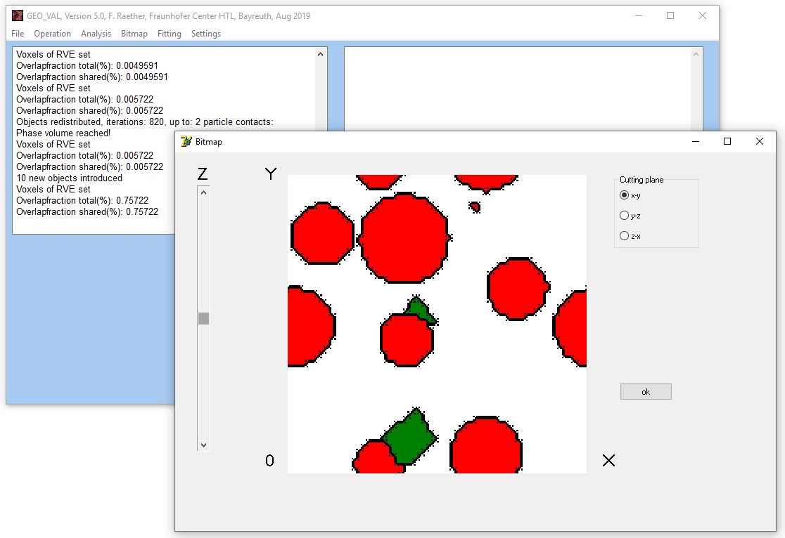
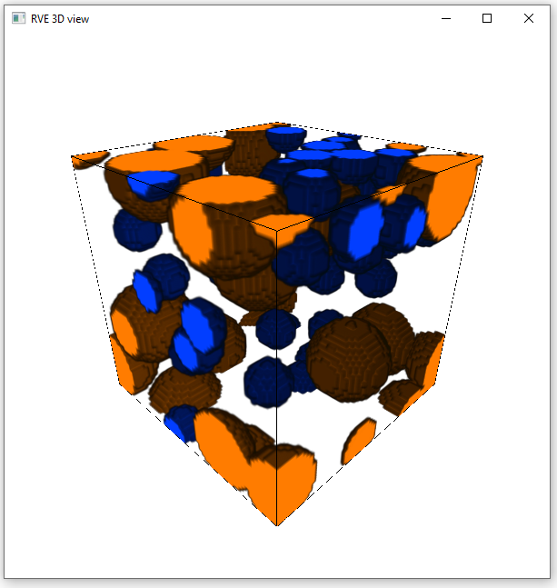
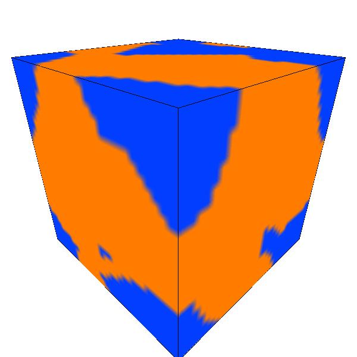
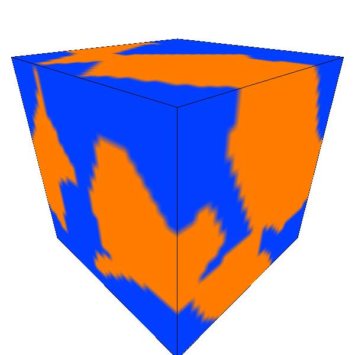
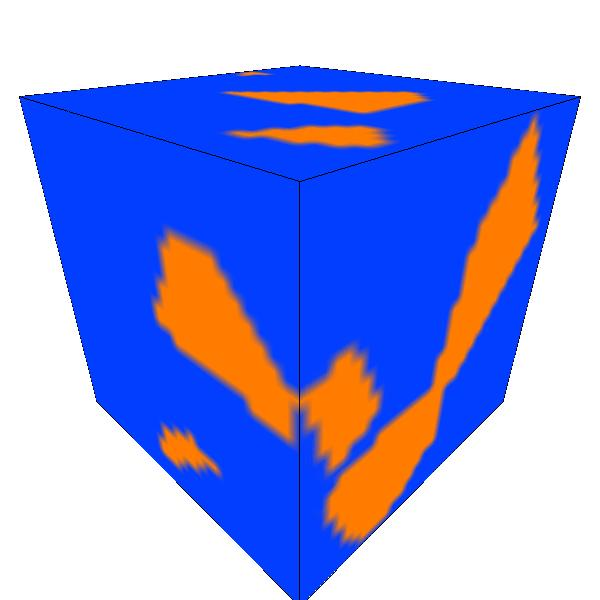
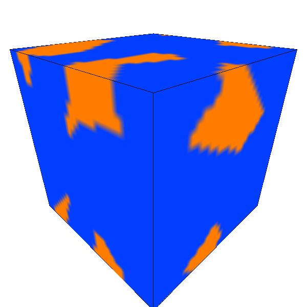

.. _geoval-reference-label:

RVE generation
==============
``GeoVal`` is a GUI program for voxel-based generation of RVEs written in 
``Delphi``. 

The program was extended by a console interface making use of the 
already existing protocol functionality which was originally intented for 
batch generation of RVEs.
This makes it possible to communicate with ``GeoVal`` from within python using 
pipes. Note that you will need the modified ``GeoVal`` executable s.t. python 
can communicate with the program.

For RVE generation you first need to create a 
:class:`~MPaut.geoval_subprocess.GeoVal_Communicator` which will launch 
``GeoVal``. In the creation, should specify the path to the ``GeoVal`` 
executable:

.. testsetup::

    import os
    os.chdir("../.")

.. doctest::

	>>> from MPaut import geoval_subprocess

	# launch GeoVal for control from within python
	>>> geo_comm = geoval_subprocess.GeoVal_Communicator(executable='bin/geo_val.exe')
	
Now you can initialize the RVE and add some objects:

.. doctest::

	>>> geo_comm.initialize_rve(rve_dims=64, voxel_size_um=1.0)
	>>> geo_comm.introduce_objects(N=30, object_type='sphere')
	>>> geo_comm.introduce_objects(N=5, object_type='tube')
	
.. warning::
    Due to limitations in ``GeoVal``, it is only possible to introduce objects 
    of a given type at most four times. This means you can call 
    ``introduce_objects(...)`` a maximum of four times for each ``object_type``, 
    independent of the number of objects introduced in each call.
    
    At the moment no check is performed, so you have to keep track of the 
    number of calls yourself.

The shape of the added objects can be controlled by the ``shape_description`` 
parameter. See the documentation of 
:func:`~MPaut.geoval_subprocess.GeoVal_Communicator.introduce_objects` for a
full overview of the possible shapes and corresponding options:

.. doctest::

	>>> sphere_description = {'radius': 10.0e-6}
	>>> geo_comm.introduce_objects(N=10, object_type='sphere', shape_description=sphere_description)
	
	>>> prism_description = {'edge_length': 5.0e-6, 'thickness': 5.0e-6, 'n_edges': 4}
	>>> geo_comm.introduce_objects(N=5, object_type='prism', shape_description=prism_description)
	
You can use essential object and voxel operations:

.. doctest::

	# object operations: distribute the objects to avoid overlap
	>>> geo_comm.distribute()
	
	# voxel operations: introduce new voxels at interfaces between regions and delete small regions
	>>> geo_comm.intro_at_interfaces()
	>>> geo_comm.delete_small_regions()
	
You can retrieve information about the generated RVE:

.. doctest::

	>>> vol_frac = geo_comm.get_volume_fractions()
	>>> print("volume fractions: ", vol_frac)
        volume fractions:  {1: ..., 2: ..., 3: ..., 7: ...}

	>>> reg_ana = geo_comm.get_3d_region_analysis()
	>>> print("region analysis: ", reg_ana)
        region analysis:  {1: {'region_count': ..., 'local_anisotropy_variance': ...}, 2: {'region_count': ..., 'local_anisotropy_variance': ...}, 3: ..., 7: ...}
	
The generated RVE can also be viewed as a 3D plot and stored to file:

.. doctest::

	>>> geo_comm.view_voxels()      # doctest: +SKIP
	>>> geo_comm.store_voxels('voxels.val') 

	
At any point you can hand back control of ``GeoVal`` to the GUI. This is 
useful for manually fine-tuning the generated RVE.

.. doctest::

	>>> geo_comm.end_communication()

.. testcleanup::

    geo_comm.close()
    
.. _geoval-zta-example:
=========================================
Example: Generation of ZTA microstructure
=========================================
The example script below illustrates how the python interface to ``GeoVal`` can
be used to generate RVEs for zirconia-thoughened-alumina (ZTA) ceramics with
varying volume fractions of zircona and alumina automatically.

.. literalinclude:: ../examples/examples_zta_generation.py

Below you can find some snapshots of the generated RVEs with different volume
fractions:

  
  Volume fraction 20 - 80
  

  
  Volume fraction 40 - 60
  

  
  Volume fraction 60 - 40
  

  
  Volume fraction 80 - 20

For a detailed description of mesh generated for different volume fractions,
see the documentation :ref:`volume_fraction_mesh-reference-label`.

====================
GeoVal output format
====================
``GeoVal`` will output the voxel structure as a ``.val`` file. This is an ASCII
file representing the voxel data in a custom format. Have a look at 
:download:`this example file <_static/example.val>`.

The first line contains information about the size of the RVE (in this case 
``16x16x16`` with a scale factor of ``1.0 * 1.0e-6 m``)::

    # dim_x       dim_y          dim_z        scale_factor
    16             16             16             1   
    
    
The following lines contain the actual data (grouped in ``dim_x`` blocks where 
each block has ``dim_y`` lines, which each line having ``dim_z`` entries)::

    # first block (x = 0)
    # first row (y = 0)
    100001         100001         100001         ...
    # second row (y = 1)
    100001         100001         100001         ...
    ...
    0              100001         100001         ...
    
    # second block (x = 1)
    100001         100001         100001         ...
    ...
    0              0              0              ...
    
    ...
    
Each value corresponds to a single voxel and encodes the phase and object 
number for that voxel. The value is determined by::

    value = 100000 * phase_number + object_number
    
So a voxel with a value of ``100001`` is associated with ``phase_number=1`` and 
``object_number=1``, whereas a voxel with a value of ``700012`` belongs to 
``phase_number=7`` and ``object_number=12``.

For a detailed description of parameters required for different kinds of object generation in ``GeoVal``,
see the documentation :ref:`GeoVal_object-reference-label`.
  