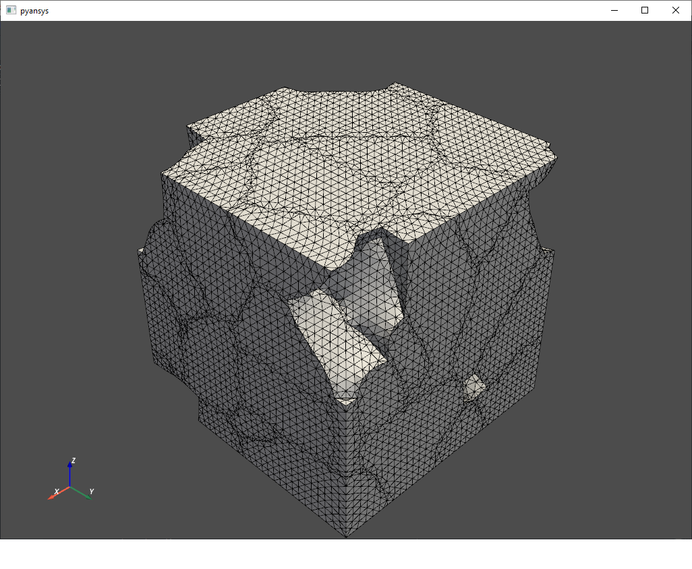

.. _volume_fraction_mesh-reference-label:

===============================================
Effect of volume fraction on Elastic properties 
===============================================

The following examples explain how the mixing ratio of the hybrid ceramics affects the material properties.
The changes in the ``Elastic modulus`` and ``Poisson's ratio`` with increasing the ``volume fraction`` of ``ZrO2``
in ZTA ceramics are shown below.

The below python code is for the generation of ZTA structure of object type ``sphere`` 
with a range of volume fractions from 11% to 89%. 
The generated structure had pores in the structure.

.. doctest::
	
	>>> options={'solver_tolerance': 0.01}
	>>> outpath = generate_zta_rves(rve_dim=16, n_obj=20, n_vol_fracs=11, n_rves=1, outpath='output')
	>>> geo_comm.introduce_objects(N=round(frac*n_obj), object_type='sphere', shape_description={'radius': 5.0e-6})
	>>> geo_comm.introduce_objects(N=round((1-frac)*n_obj), object_type='sphere', shape_description={'radius': 5e-6})
	
The phase number of materials that are to be defined in ``phase_mat_params`` has to be seen in the file ``_main.win``
and then properties for all the materials has to be defined in the ``ansys.py`` file as shown below.

.. doctest::
	
	>>> phase_mat_params = { 'ZrO2': {'phase_number': 4,'emod': 200, 'pois': 0.31},'Al2O3': {'phase_number': 10, 'emod': 380, 'pois': 0.23},'Pore': {'phase_number': 10000, 'emod': 1e-4 * 1e-9, 'pois': 1e-4}}

The tetra mesh generated with  approximately ``1% Pores`` phase.

  
The tetra mesh generated for ``sphere`` object with  approximately ``8% ZrO2`` phase.
  

  
The tetra mesh generated for ``sphere`` object with  approximately ``90% Al2O3`` phase.
 
.. figure:: Volume_Fraction_Images/Sphere_Al2O3_90% .png
  :width: 500 
 
Plot for change in ``Elastic modulus`` with different volume fractions of ZrO2.
							 

  	
Plot for change in ``poisions ratio`` with different volume fractions of ZrO2.
	

  
The below python code is for the generation of ZTA structure of object type ``voronoi_polyeder`` 
with pore-free voxel models (N = 16, n = 20) and a range of volume fractions from 11% to 89%.

.. doctest::
	
	>>> outpath = generate_zta_rves(rve_dim=16 n_obj=20, n_vol_fracs=11, n_rves=1, outpath='output')
	>>> geo_comm.introduce_objects(N=round(frac*n_obj), object_type='voronoi_polyeder', shape_description={'radius': 5.0e-6})
	>>> geo_comm.introduce_objects(N=round((1-frac)*n_obj), object_type='voronoi_polyeder', shape_description={'radius': 5e-6})
	
The tetra mesh generated for ``voronoi_polyeder`` object with approximately ``12% ZrO2`` phase.	

The tetra mesh generated for ``voronoi_polyeder`` object with approximately ``88% Al2O3`` phase.

Plot for change in ``Elastic modulus`` with different volume fractions of ZrO2.

  

Plot for change in ``poisions ratio`` with different volume fractions of ZrO2.
  

  
===============================================  
Limitations  
===============================================

Generation of RVE without pores with object types other than ``voronoi_polyeder`` is challenging.
There is limitation on the percentage of ``Overlapfraction total``. When the maximum number of overlap particles
exceeds ``5`` with the percentage of overlap fraction ``>20%`` then the operation ``distribute()`` is
unable to reduce the total percentage of overlap fraction to less than five. This fails to generate the RVE. 

In such a case the size of the shape description parameters and number of objects introduced 
in the ``RVE`` should be reduced such that the percentage of ``Overlapfraction total`` should be low.

The below python code is for the generation of ZTA structure of object type ``voronoi_polyeder`` 
with pore-free voxel models (N = 16, n = 50) and a range of volume fractions from 2% to 98%.

	
.. doctest::
	
	>>> options={'solver_tolerance': 0.01}
	>>> outpath = generate_zta_rves(rve_dim=16, n_obj=50, n_vol_fracs=50, n_rves=1, outpath='output')
	>>> geo_comm.introduce_objects(N=round(frac*n_obj), object_type='voronoi_polyeder', shape_description={'radius': 5.0e-6})
	>>> geo_comm.introduce_objects(N=round((1-frac)*n_obj), object_type='voronoi_polyeder', shape_description={'radius': 5e-6})
	
	

  	
	

.. note::

   The above python code with object type ``sphere`` did not generated the voxel structure.
   The voxel structure is generated by changing the ``radius`` of object from ``5.0e-6`` to ``2.0e-6``.

The below python code is for the generation of ZTA structure of object type ``sphere`` 
with volume fractions of ``ZrO2`` ranging from ``2%`` to ``98%``. 

The generated structure with these parameters had porosity in it. The percentage of porosity is not same for 
all volume fractions.

	
.. doctest::
	
	>>> outpath = generate_zta_rves(rve_dim=16, n_obj=50, n_vol_fracs=50, n_rves=1, outpath='output')
	>>> geo_comm.introduce_objects(N=round(frac*n_obj), object_type='sphere', shape_description={'radius': 2.0e-6})
	>>> geo_comm.introduce_objects(N=round((1-frac)*n_obj), object_type='sphere', shape_description={'radius': 2.0e-6})
	

  
.. note::

   ``Best practice`` to generate the RVE for different volume fractions is first
   generating the ``voxel structure``, ``meshing voxel``, ``ansys simulation`` for certain
   volume fraction by introducing the required number and type of objects.

.. note::

	Generation of the voxel structure with higher number of volume fractions by uncommenting 
	the below line of code is raising error message after generating random number of structures.

.. doctest::

	>>> geo_comm.view_voxels('snapshot.jpg')

Plots of variation in material properties with volume fraction for the microstructure generated with the below code.

.. doctest::
	
	>>> options={'solver_tolerance': 1e-6}
	>>> outpath = generate_zta_rves(rve_dim=16, n_obj=20, n_vol_fracs=50, n_rves=3, outpath='output')
	>>> geo_comm.introduce_objects(N=round(frac*n_obj), object_type='voronoi_polyeder', shape_description={'radius': 5.0e-6})
	>>> geo_comm.introduce_objects(N=round((1-frac)*n_obj), object_type='voronoi_polyeder', shape_description={'radius': 5.0e-6})
	

  	
	

Python code for plotting the graphs of changes in properties with different volume fractions of 
``ZrO2`` is given below.

.. code:: python

	import ast
	import matplotlib.pyplot as plt

	'''
	Plots Youngs modulus, Shear modulus, Bulk modulus, Poissons ratio for 
	Hill Average, Reuss average, Voigt average methods

	Input Parameter : 'results_elasticity.txt' file in the current folder

	'''

	f = open('results_elasticity.txt') 
	data = f.read()
	dic1 = ast.literal_eval(data.replace('array', ''))

	ZrO2 = []
	Al2O3 = []
	Pores = []
	components = []

	Youngs_modulus_Hill = []
	Shear_modulus_Hill  = []
	Bulk_modulus_Hill   = []
	Poissons_ratio_Hill = []

	Youngs_modulus_Reuss = []
	Shear_modulus_Reuss  = []
	Bulk_modulus_Reuss   = []
	Poissons_ratio_Reuss = []

	Youngs_modulus_voigt  = []
	Shear_modulus_voigt   = []
	Bulk_modulus_voigt    = []
	Poissons_ratio_voigt  = []

	for key in dic1 :   
		key1 = dic1.keys()
		print('All components and their Volume fractions as keys :',key1)
		print("-------------------------------------------------------")
		val1 =  dic1[key]
		print('Elasticity results for particular volume fraction :',val1)
		print("-------------------------------------------------------")
		key2 = val1.keys()
		print('Properties as keys for particular volume fraction :',key2)
		print("-------------------------------------------------------")
		
		val2 = val1['hill_avg']
		Youngs_modulus_Hill.append(val2['E'])
		Shear_modulus_Hill.append(val2['G'])
		Bulk_modulus_Hill.append(val2['K'])
		Poissons_ratio_Hill.append(val2['nu'])
		print('Dictionary of different Modulus and Poissons ratio for Hill_Avg :',val2)
		print("-------------------------------------------------------")
		
		val2_Reuss = val1['reuss_avg']
		Youngs_modulus_Reuss.append(val2_Reuss['E'])
		Shear_modulus_Reuss.append(val2_Reuss['G'])
		Bulk_modulus_Reuss.append(val2_Reuss['K'])
		Poissons_ratio_Reuss.append(val2_Reuss['nu'])
		print('Dictionary of different Modulus and Poissons ratio for Reuss_Avg :',val2_Reuss)
		print("-------------------------------------------------------")
		
		val2_voigt = val1['voigt_avg']
		Youngs_modulus_voigt.append(val2_voigt['E'])
		Shear_modulus_voigt.append(val2_voigt['G'])
		Bulk_modulus_voigt.append(val2_voigt['K'])
		Poissons_ratio_voigt.append(val2_voigt['nu'])
		print('Dictionary of different Modulus and Poissons ratio for Voigt_Avg :',val2_voigt)
		print("-------------------------------------------------------")
			  
		# Extracting the volume fraction of all components  
		dic2 = str(key)
		print(key)
		print(dic2)
		d = dict(x.split(":") for x in dic2.split(", "))
		
		components = list(d.keys())
		ZrO2.append(d['ZrO2'])
		Al2O3.append(d['Al2O3'])
		Pores.append(d['Pores'])

	# Converting volumefraction from string to list of float values
	ZrO2 = list(map(float, ZrO2))
	Al2O3 = list(map(float, Al2O3))
	Pores = list(map(float, Pores))

	print('List of Voigt Elastic Modulus for different volume fraction',Youngs_modulus_voigt)
	print('List of Voigt Shear Modulus for different volume fraction',Shear_modulus_voigt)
	print('List of Voigt Bulk Modulus for different volume fraction',Bulk_modulus_voigt)
	print('List of Voigt Poissons ratio for different volume fraction',Poissons_ratio_voigt)
	print('List  of names of all componenets',components)
	print('List of volume fractions of Zirconium Oxide',ZrO2)
	print('List of volume fractions of Alluminium Oxide',Al2O3)
	print('List of volume fractions of Pores',Pores)

	# Plotting of Properties

	# plt.subplot(4, 1, 1)
	plt.plot()
	plt.scatter(ZrO2, Youngs_modulus_Hill)
	plt.scatter(ZrO2, Youngs_modulus_Reuss)
	plt.scatter(ZrO2, Youngs_modulus_voigt)

	# plt.title('Elastic properties')
	plt.xlabel('Volume fraction of ZrO2 in %')
	plt.ylabel('Modulus of Elasticity in Gpa')
	plt.legend(["Hill_Avg", "reuss_avg", "voigt_avg"])
	plt.show()

	# plt.subplot(4, 1, 2)
	plt.plot()
	plt.scatter(ZrO2, Shear_modulus_Hill)
	plt.scatter(ZrO2, Shear_modulus_Reuss)
	plt.scatter(ZrO2, Shear_modulus_voigt)

	# plt.title('Elastic properties')
	plt.xlabel('Volume fraction of ZrO2 in %')
	plt.ylabel('Shear Modulus in Gpa')
	plt.legend(["Hill_Avg", "reuss_avg", "voigt_avg"])
	plt.show()

	# plt.subplot(4, 1, 3)
	plt.plot()
	plt.scatter(ZrO2, Bulk_modulus_Hill)
	plt.scatter(ZrO2, Bulk_modulus_Reuss)
	plt.scatter(ZrO2, Bulk_modulus_voigt)

	# plt.title('Elastic properties')
	plt.xlabel('Volume fraction of ZrO2 in %')
	plt.ylabel('Bulk Modulus in Gpa')
	plt.legend(["Hill_Avg", "reuss_avg", "voigt_avg"])
	plt.show()

	# plt.subplot(4, 1, 4)
	plt.plot()
	plt.scatter(ZrO2, Poissons_ratio_Hill)
	plt.scatter(ZrO2, Poissons_ratio_Reuss)
	plt.scatter(ZrO2, Poissons_ratio_voigt)

	# plt.title('Poissons ratio')
	plt.xlabel('Volume fraction of ZrO2 in %')
	plt.ylabel('Poissons ratio')
	plt.legend(["Hill_Avg", "reuss_avg", "voigt_avg"])
	plt.show()

.. doctest::

	>>> options={'solver_tolerance': 0.01}
	>>> outpath = generate_zta_rves(rve_dim=16, n_obj=20, n_vol_fracs=11, n_rves=3, outpath='output')
	>>> geo_comm.introduce_objects(N=round(frac*n_obj), object_type='voronoi_polyeder', shape_description={'radius': 5.0e-6})
	>>> geo_comm.introduce_objects(N=round((1-frac)*n_obj), object_type='voronoi_polyeder', shape_description={'radius': 5e-6})

The plots generated with the given python code for the microstructure properties generated with the above parameters are shown below.

  

	
Plots for variation in properties for different volume fractions of ``ZrO2`` with ``solver_tolerance = 1e-6``
are shown below.
	
	

  

  
===============================================  
Designing a material with required properties
===============================================

From the above examples it is seen that the elastic properties of material depend on
the percentage of volume fraction of ZrO2 in ZTA ceramics. Introducing different object types with different volume fractions will give wide range of  
material properties. 

After obtaining sufficient data on dependence of properties on ``object types``, ``volume fraction``, amount of 
``porosity``, ``number of objects``, etc. it is possible to design new materials of desired properties by applying machine learning
algorithms to the available data.

===============================================  
Procedure for generating microstructure with controlled porosity
===============================================

The Python code given below can generate the ``voronoi_polyeder`` microstructure with required percentage of ``porosoity``,
``ZrO2``, ``Al2O3``. The user need to give percentage of porosity and ZrO2 required in the final structure.

	 
.. code:: python

		"""
		This example demonstrates how the microstructure generation pipeline can be
		used to generate meshes for porous ZTA microstrutures.

		This example originates from the AirFox project where the goal was to model 
		the matrix phase of infiltrated ceramic fibre composites. 
		The matrix consists of Alumina (Al2O3) and Zirconia (ZrO2) with a volume ratio 
		of Al2O3 : ZrO2 = 84 / 16.
		In addition, the microstructure has a relatively high porosity of about 30 %.

		The example demonstrates how to generate multiple RVEs with the given 
		properties and how to prepare them into a mesh for simulation with Ansys.
		"""
		import random
		import os
		import ast

		from pprint import pformat
		from pathlib import Path

		from MPaut import geoval_subprocess, voxsm_subprocess

		def generate_volume_fraction(frac, n_obj, geo_comm, rve_dim=32, voxel_size_um=1.0, 
									 randseed=None, method='voronoi', target_porosity=0.0,
									 use_dilation=True):
			"""This function generates a two-phase voronoi type RVE with a given volume fraction of the two phases.
			
			There are two different options to generate the RVE. The first method 
			``'voronoi'`` creates ``n_obj`` GeoVals voronoi objects and assigns them to
			one of the two phases according to the given volume fraction.
			This often produces rather enlongated grains and may not be desired.
			
			Alternatively, the second method ``spheres`` does not directly introduce 
			voronoi objects but instead first introduces ``n_obj`` spheres, 
			distributes them to avoid overlap and then converts them to voronoi 
			objects with the given volume fractions.
			
			After the base RVE has been generated, pores are added by randomly 
			introducing voxels at the corners, edges or faces of the grains until the
			given porosity percentage is achieved. Note that this may not always be
			possible (no checks are performed!).    
			

			Parameters
			----------
			frac : float
				Target volume fraction for one of the phases. The other phase will have
				a volume fraction of ``1 - frac``.
			n_obj : int
				Number of objects to create in the RVE.
			geo_comm : GeoVal_Communicator
				Communicator object to interact with GeoVal.
			rve_dim : int, optional
				Voxel dimension of RVE. The default is ``32``.
			voxel_size_um : float, optional
				Spacing of a single voxel in the RVE. The default is ``1.0``.
			randseed : int, optional
				Random seed to use for generation. The default is ``None``.
			method : str, optional
				Method to use for the structure generation. The two options are
				``'voronoi'`` and ``'spheres'``. The default is ``'voronoi'``.
			target_porosity : float, optional
				Target porosity of the RVE. The default is ``0.0``.
			use_dilation : bool, optional
				This option control whether dilation operations are used when adding
				porosity to the RVE. The default is ``True``.

			Returns
			-------
			info_dict : dict
				Dictionary with information about the generated RVE such as volume 
				fractions, porosity, etc.

			"""
			 # create an empty RVE
			geo_comm.initialize_rve(rve_dims=rve_dim, voxel_size_um=voxel_size_um)
			if randseed is not None:
				geo_comm.set_randseed(randseed)
			
			if method == 'voronoi':
				# 1. option: generating ZTA structures with voronoi method
				geo_comm.introduce_objects(N=round(frac*n_obj), object_type='voronoi_polyeder', 
											shape_description={'radius': 5.0e-6})
				geo_comm.introduce_objects(N=round((1-frac)*n_obj), object_type='voronoi_polyeder', 
										   shape_description={'radius': 5e-6})
				# distribute the objects s.t. there is no overlap
				geo_comm.distribute()
			elif method == 'spheres':    
				# 2. option: generate spheres, distribute them and then transform them
				# to voronoi objects
				geo_comm.introduce_objects(N=n_obj, object_type='sphere', 
										shape_description={'radius': 5.0e-6})
				# distribute the objects s.t. there is no overlap
				geo_comm.distribute()
				geo_comm.distribute()
				geo_comm.distribute()
				
				# transform spheres (phase 1) to voronoi polyeders
				geo_comm.transform_objects(n_obj, 1, 'voronoi_polyeder', 
										   shape_description={'radius': 5.0e-6})
				
				# split voronoi polyeder (phase 4) to achieve the desired volume fraction
				geo_comm.split_objects(4, fraction=frac)
				
			# add porosity
			vol_fracs = geo_comm.get_volume_fractions()
			porosity = 1.0 - sum(vol_fracs.values())
				
			i = 0
			while porosity < target_porosity:
				print(f"Volume fractions = {vol_fracs}, porosity = {porosity}")
				# randomly introduce pores at corners, edges or faces
				mode = random.choice([('corners', 0.3), ('edges', 0.1), ('faces', 0.01)])
				#mode = ('corners', target_porosity)
				geo_comm.intro_at_interfaces(mode=mode[0], phase=0, fraction=mode[1])

				# get new porosity        
				vol_fracs = geo_comm.get_volume_fractions()
				porosity = 1.0 - sum(vol_fracs.values())

				if porosity < target_porosity and use_dilation:
					# randomly dilate existing voxels
					mode = random.choice([1,2,3,4,5])
					
					if vol_fracs[4] > Input_ZrO2:
						geo_comm.dilation(mode, 4, repetitions=1)
					elif vol_fracs[10] > Input_Al2O3:
						geo_comm.dilation(mode, 10, repetitions=1)    
				
					# get new porosity
					vol_fracs = geo_comm.get_volume_fractions()
					porosity = 1.0 - sum(vol_fracs.values())
				
				# make sure we always terminate
				i += 1
				if i > 500:
					break
				
			print(f"Final volume fractions = {vol_fracs}, porosity = {porosity}")
			
			info_dict = {}
			info_dict["porosity"] = porosity
			info_dict["volume_fractions"] = vol_fracs
			info_dict["chord_length_analysis"] = geo_comm.get_chord_length_analysis()
			info_dict["object_analysis"] = geo_comm.get_object_analysis()
			info_dict["3d_region_analysis"] = geo_comm.get_3d_region_analysis()

			return info_dict

		''' Code for finding percentage of frac for getting controlled 
		   amount of ZrO2, Al2O3 and Porosity in the final structure'''
		   
		   
		# Required percentage of ZrO2 
		Input_ZrO2 = float(input("Enter Required percentage of  ZrO2 : "))
		# Required percentage of Porosity
		Input_Porosity = float(input("Enter Required percentage of Porosity : "))
		Input_frac = float(Input_ZrO2*100/(100-Input_Porosity))
		print(Input_frac)
		# Required percentage of Al2O3
		Input_Al2O3 = 100 - (Input_ZrO2 + Input_Porosity)

		# set target properties of the RVE
		n_rves = 2                # number of RVEs to generate            
		# frac = 0.16            # volume fraction of zirconia phase (the alumina phase will have a volume fraction of 1 - this)
		# target_porosity = 0.3   # target porosity
		frac = Input_frac/100          
		target_porosity = Input_Porosity/100
		rve_dim = 32            # voxel dimensions of the RVEs
		n_obj = 50              # number of particles in each RVE

		base_path = Path('airfox') / f'frac_{frac}'

		## generate RVEs

		for j in range(n_rves):
			
			# launch GeoVal
			geo_comm = geoval_subprocess.GeoVal_Communicator(output_folder= base_path / f'rve_{j}', 
															  executable='../bin/geo_val_parallel.exe')
			
			# run the RVE generation
			rve_info = generate_volume_fraction(frac, n_obj, geo_comm, rve_dim, voxel_size_um=1.0, randseed=j, method='spheres',
												target_porosity=target_porosity, use_dilation=True)
			
			# store RVE and additional info
			geo_comm.store_voxels('voxels.val')
			geo_comm.store_objects('objects.val')
			geo_comm.view_voxels('snapshot.jpg')
			#geo_comm.view_voxels()
			with open(geo_comm.output_folder / 'info.txt', 'w') as info:
				info.write(pformat(rve_info))
			
			geo_comm.end_communication()
			geo_comm.close()

		results = {}

		# get measure of closeness to target properties for all results
		for root, dirs, files in os.walk(base_path):
			if 'info.txt' in files:
				# gather information about generated RVE
				info = Path(root, 'info.txt').read_text()
				data_dict = ast.literal_eval(info)
				
				# get target volume fraction of phase 4 from folder name
				target_vol_frac = float(Path(root).parent.name.split('_')[1])
				
				# compute volume fractions of non-pore phases (4 and 10)
				actual_vol_frac = data_dict['volume_fractions'][4] / data_dict['volume_fractions'][10]
				actual_porosity = data_dict['porosity']
				
				measure = abs(actual_porosity - target_porosity) + abs(actual_vol_frac - target_vol_frac)
				
				results[root] = measure
			  

		# sort the result to get those that best achieve the desired property (volume fraction and porosity)
		results_sorted = list(sorted(results.items(), key=lambda x:x[1]))
		print("path to best RVE: ", results_sorted[0][0], " rating: ", results_sorted[0][1])
		
		
=======================================================================	
Effect of GeoVal structure generation parameters on Elastic properties
=======================================================================	

The variations in elastic properties with number of objects are shown below.
In the generated ``GeoVal`` structure the expected percentage of Porosity is 30% and ZrO2 is 30% and Al2O3 is 40%.
Keeping these constant percentages and number of RVEs to generate equal to ``2``,
GeoVal structures are generated by introducing different number of objects in a voxel with dimension ``32``.

.. note::

    The generated ``Geoval`` structure is having the percentage of porosity as specified but the percentage
    of ZrO2 and Al2O3 is not maintained as specified. As a result identifying the pattern for the 
    influence of number of introduced objects for a given dimension of RVE is not achieved.
 
  

  

  

  

GeoVal structures are generated with the expected percentage of Porosity = 30% and ZrO2 = 30% and Al2O3 = 40%
by introducing number of objects equal to ``50`` in a voxel with dimension of RVE equal to ``32``.
The variation in elastic properties with number of RVEs are shown below.

.. note::
 
 The generated ``Geoval`` structure is having the percentage of porosity as specified but the percentage of ZrO2 and Al2O3 is not maintained as specified.
 As a result identifying the pattern for the influence of number of RVEs for a given dimension of RVE is not achieved.

  

  

  

Effect of percentage (with a step 10) of Porosity on the elastic properties is shown below.
Percentage of ZrO2 is 10%, number of RVEs is ``2``, voxel dimension of the RVEs is ``40`` and number of particles in each RVE is ``50``.

.. note::
 
 The target percentage of ZrO2 is not maintained in the generated structure and the
 achieved maximum percentage of porosity introduced in the structure is ``~33%`` .

  

  

  

Effect of voxel dimensions of the RVEs on the elastic properties is shown below.
Expected percentage of ZrO2 and Porosity is 30%, number of RVEs is ``2`` and number of
particles in each RVE is ``30``.

.. note::
 
 The target percentage of ZrO2 is not maintained in the generated structure.
 The outlier is because the generated ansys structure has ``0%`` porosity for the case of voxel dimensions equal to 40 with number of RVEs = 1.

.. note::
 
 Modification of the code for the generation of the ``GeoVal`` structures with controlled percentage of ``ZrO2``
 and ``Porosity`` will give good results for identifying dependence of properties on each parameters by keeping
 remaining parameters as user specified. Also implementing measure of closeness to target percentage of
 ``ZrO2`` in addition to ``Porosity`` will reduce the simulation time by selecting the ``GeoVal`` structure close to the user specifications.

  

  

  
The pattern for variation in properties of structure generated by increasing percentage of ``ZrO2`` with a step of ``5%``, maintaining ``Porosity`` equal to
``10%``, number of RVEs equal to ``2``, voxel dimensions of the RVEs equal to ``32`` and number of particles in each RVE equal to ``80``
is shown below.

  

  

The pattern for variation in properties of structure generated by increasing percentage of ``ZrO2`` with a step of ``10%``, maintaining ``Porosity`` equal to
``10%``, number of RVEs equal to ``2``, voxel dimensions of the RVEs equal to ``32`` and number of particles in each RVE equal to ``30``
is shown below.

  

  

The pattern for variation in properties of structure generated by increasing percentage of ``ZrO2`` with a step of ``10%``, maintaining ``Porosity`` equal to
``10%``, number of RVEs equal to ``2``, voxel dimensions of the RVEs equal to ``32`` and number of particles in each RVE equal to ``60``
is shown below.

  

  

The pattern for variation in properties of structure generated by increasing percentage of ``ZrO2`` with a step of ``10%``, maintaining ``Porosity`` equal to
``10%``, number of RVEs equal to ``2``, voxel dimensions of the RVEs equal to ``32`` and number of particles in each RVE equal to ``80``
is shown below.

  

  

The pattern for variation in properties of structure generated by increasing percentage of ``ZrO2`` with a step of ``10%``, maintaining ``Porosity`` equal to
``10%``, number of RVEs equal to ``3``, voxel dimensions of the RVEs equal to ``40`` and number of particles in each RVE equal to ``50``
is shown below.

  

  

  