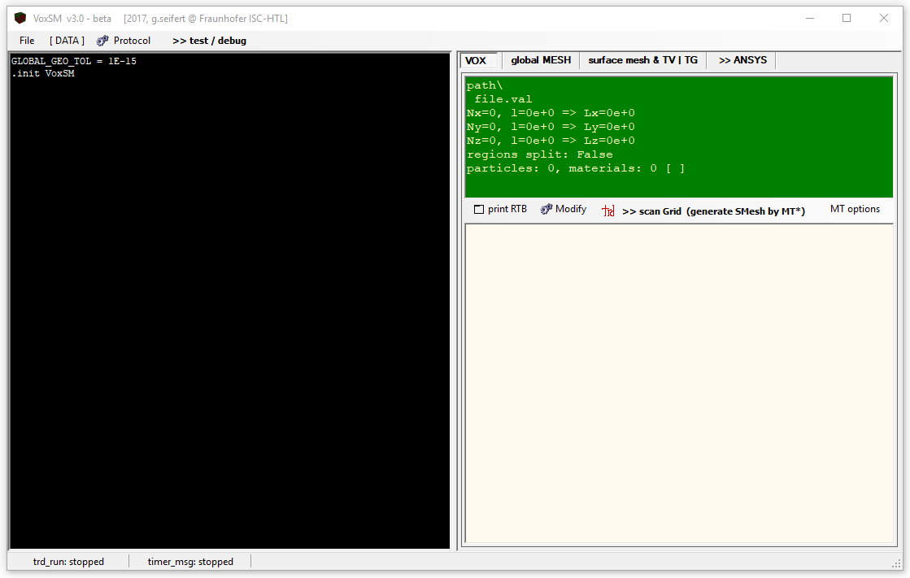
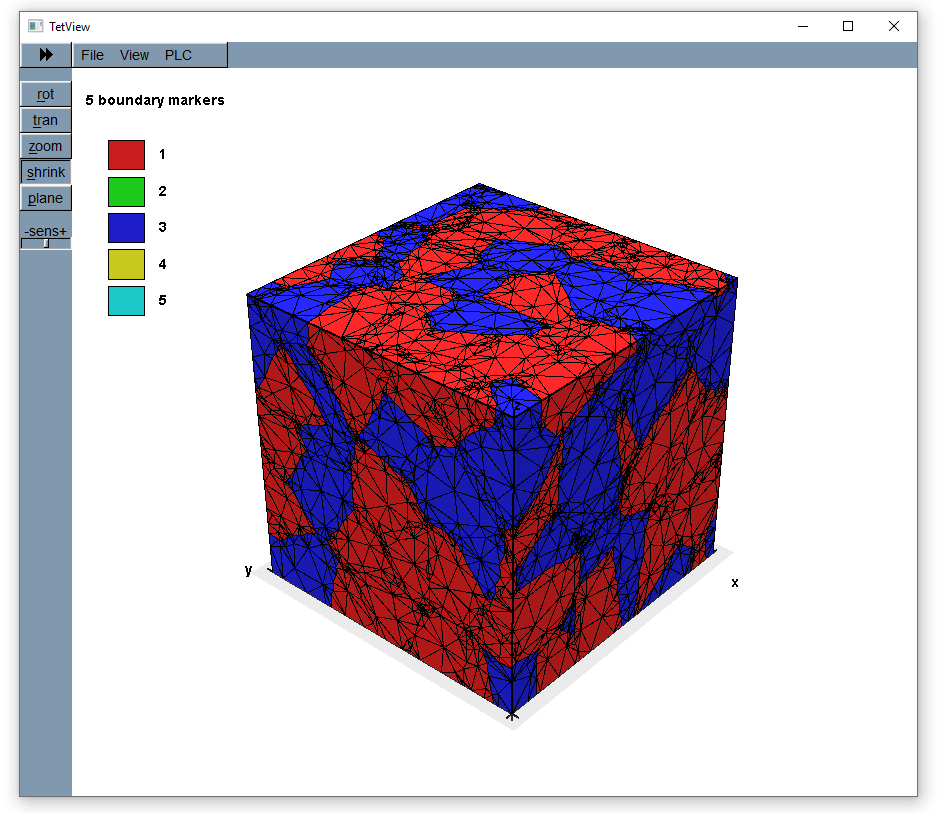
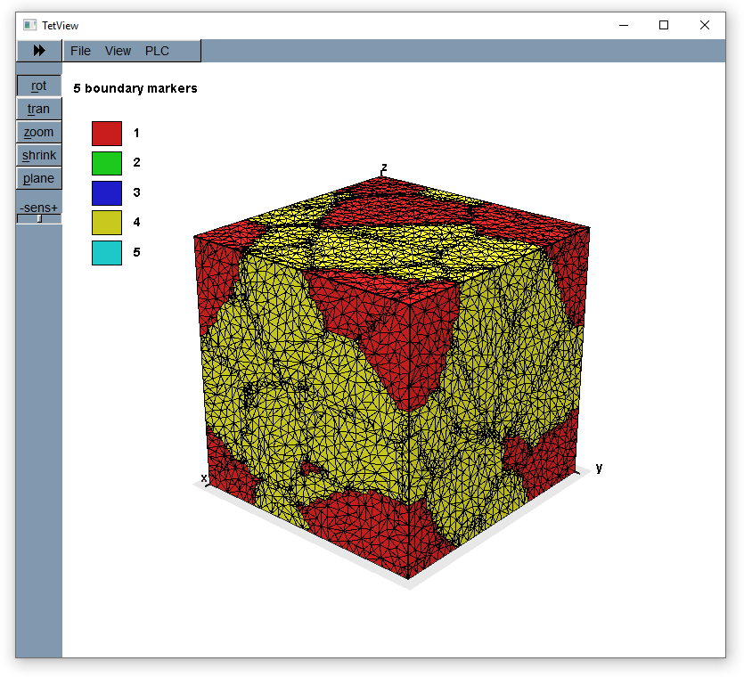

.. _voxsm-reference-label:

RVE meshing
===========

After the voxel RVE has been created an intermediate step is neccessary to 
generate a mesh that can be used for simulations in ``ANSYS``.
This step is performed by ``VoxSM`` which implements a 
`marching tethrahedron <https://en.wikipedia.org/wiki/Marching_tetrahedra>`_ 
method to generate a surface mesh from the volumetric voxel data.
The program also provides routines for mesh smoothing and simplification as 
well as output of node and element files readable by ``ANSYS``.

``VoxSM`` is a GUI program written in ``C++``. Interfacing to the program in 
the same way as with ``GeoVal`` (i.e. via console communication) turned out 
to be challenging (due to issues with mixed console-GUI applications in MFC).
Instead, `pywinauto <https://pypi.org/project/pywinauto/>`_ was used to 
generate a python-ish interface to the program.
In essence, `pywinauto <https://pypi.org/project/pywinauto/>`_ makes it 
possible to automate the GUI interaction via python. 

As with GeoVal, the first step is to create a 
:class:`~MPaut.voxsm_subprocess.VoxSM_Communicator`, specifying the path of 
the ``VoxSM`` executable:

.. code:: python

        from MPaut import voxsm_subprocess

        # launch VoxSM process
        voxsm_comm = voxsm_subprocess.VoxSM_Communicator(executable='bin/VoxSM_2017_x64.exe')

Next, load a voxel file generated by ``GeoVal``:

.. code:: python

        voxsm_comm.open_voxel_file('voxels.val')

It is possible to print information about the voxel data:

.. code:: python

        voxsm_comm.print_particles()
        voxsm_comm.print_materials()

VoxSM generates a mesh from the voxels:

.. code:: python

        voxsm_comm.split_regions()
        voxsm_comm.generate_mesh()

The generated mesh can be modified by smoothing and simplification:

.. code:: python

        voxsm_comm.adaptive_smooth()
        # a single simplify run
        voxsm_comm.simplify({'runs': 1})
        # simplify until the given number of vertices is reached
        voxsm_comm.adaptive_simplify(max_vertices=50000)

Afterwards, the mesh can be written to a file for visualization or successive 
processing in ANSYS:

.. code:: python

        voxsm_comm.store_mesh()
        voxsm_comm.store_ansys()
        
You can visualize the generated mesh using the external program 
`Tetview <https://wias-berlin.de/software/tetgen/tetview.html>`_:

  
.. warning::
    The values in the mesh files (``*.smesh``) generated by ``VoxSM`` are 
    output in the number format which is determined by the regional format 
    setting of the Windows system. By default, these settings will probaly use 
    the german number format, i.e. ``123.456.789,00`` with ``,`` for the decimal
    separator and ``.`` for grouping. You must change the format to output 
    numbers as ``123456789.00`` (use ``.`` as the decimal separator and use no
    grouping separator), otherwise you will encounter errors.
  
======================================
Example: Meshing of ZTA microstructure
======================================
This example continues the previous example 
(see: :ref:`Example: Generation of ZTA microstructure`.)
and shows how to automatically create meshes for the generated voxel files.

.. literalinclude:: ../examples/examples_zta_meshing.py

  
  Mesh generated by VoxSM for RVE with volume fraction 20 - 80

==================
VoxSM output files
==================
When running 

.. code:: python

        voxsm_comm.store_ansys()
        
``VoxSM`` will output several files in the folder where the original ``.val``
file is located. These script files contain ``APDL`` commands for the 
definition of nodes, elements and particles as well as a set of commands for 
filling the surface meshes by tetrahedral volume elements. In the following, 
we give a brief overview of the generated files and describe their contents:

- ``1_nodes.win`` - defines vertex positions of the mesh::

    n,1, 0, 0, 0
    n,2, 7.692673446045072E-07, 0, 0
    n,3, 5.5915099805451207E-07, 0, 5.5922092238525871E-07
    n,4, 5.5965262257976324E-07, 5.5966404060605368E-07, 0
    n,5, 0, 7.6926180375779932E-07, 0
    n,6, 0, 0, 7.6903271972370354E-07
    ...

- ``2_SHELL_GB_RVE.win`` - defines elements (triangles) and components (groups) of elements corresponding to geometric objects or particles in ``GeoVal``)::
  
    type,2
    Mat,20000           ! set material type for subsequent elements
    
    ! definition of component c_0 
    esel,none
    type,3              ! use element type 3 for subsequent elements 
    e, 68, 69, 70, 70,  ! create a (triangular) element referring to nodes 68, 69, 70
    type,2              ! switch to element type 2 for subsequent elements
    e, 71, 72, 73, 73, 
    type,3
    e, 68, 72, 73, 73, 
    e, 68, 69, 73, 73, 
    type,2
    e, 71, 72, 74, 74, 
    type,3
    e, 68, 72, 74, 74, 
    e, 68, 74, 75, 75, 
    e, 68, 70, 76, 76, 
    ...
    e, 54363, 54487, 59154, 59154, 
    type,3
    e, 54487, 59153, 59154, 59154, 
    e, 54487, 54489, 59153, 59153, 
    e, 54483, 54489, 59153, 59153, 
    CM,c_0,Elem         !group all selected elements in component c_0
    
    ...

- ``3_CMs_mesh.win`` - fills components with volumetric elements::

    type,1  ! set element type to 1 for created elements
    
    CMsel,s,c_0         ! select component c_0
    Mat,10000           ! set material number to 10000
    FVmesh,keepShells   ! create volume mesh for component (particle) c_0
    esel,r,type,,1
    CM,v_0,Elem         ! create a new component for the volume elements
    
    CMsel,s,c_100001    ! select component c_100001
    Mat,1               ! set material number to 1
    FVmesh,keepShells   ! ...
    esel,r,type,,1
    CM,v_100001,Elem
    
    ...

- ``_main.win`` - main script which executes the above scripts and stores the 
  resulting mesh in a database for later use
  
- ``2_GB_prisms.win`` - introduces shell elements at the grain boundaries 
  (used to model boundary layer effects) 
.. note::
  The ``2_GB_prisms.win`` file is only present if grain boundary meshing was 
  selected when generating the ANSYS output, see:
  :py:meth:`MPaut.voxsm_subprocess.VoxSM_Communicator.store_ansys`
  If it is present, the numbering of the above files is different.
  
You can run the mesh creation in the ``APDL`` command prompt using::

    /input, _main, win

This will generate a mesh and store it in a database in the Ansys working 
directory for subsequent simulations. The following section describes how the 
this process can be automated and integrated in a simulation pipeline using 
`PyMAPDL <https://mapdldocs.pyansys.com/>`_.

For a detailed description of different ways of mesh generation using different parameters,
see the documentation :ref:`voxsm_mesh_generation-reference-label`.
