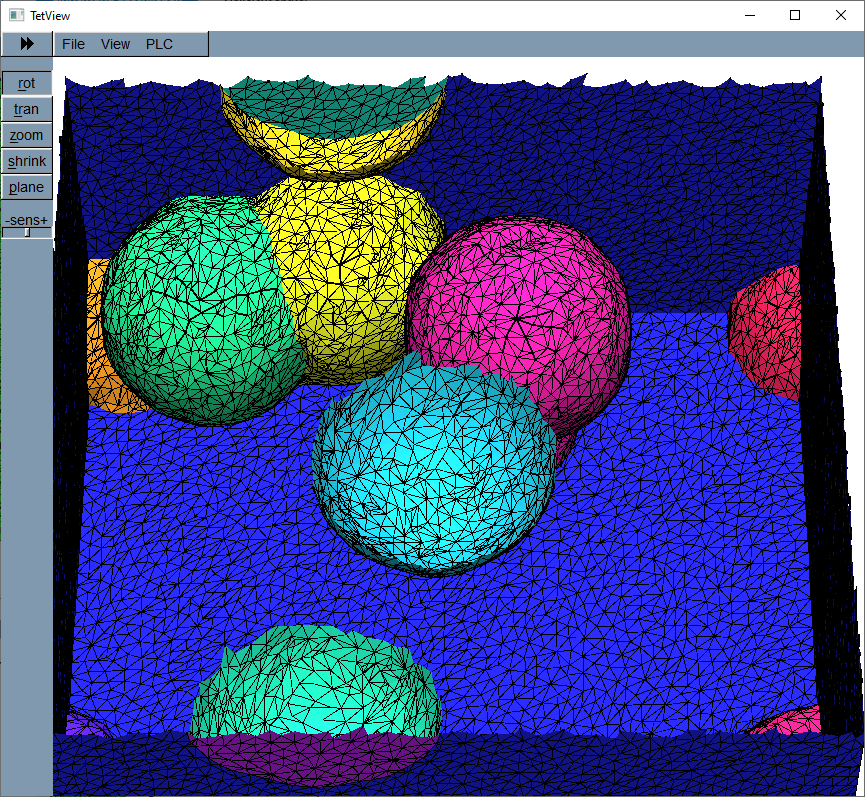

.. _voxsm_mesh_generation-reference-label:

======================================
Refinement of Mesh generated by VoxSM
======================================

The quality of the final tetra mesh generated depends upon the quality of the 
mesh generated by ``VoxSM``. Smoothness of mesh surfaces will be increased by increasing 
the number of times the operations ``do Smooth``, ``build Edge-Heap``, ``do SIMPLIFY Mesh`` 
are implemented and their sequences.

  

  

 
1. General sequence of operations are:

   -> ``do Smooth``
   -> ``build Edge-Heap``
   -> ``do SIMPLIFY Mesh``.

   
   Generated structure with default parameters consists of coarse mesh with rough surfaces.
   

  

  
2. The following sequence of operations with default parameters will generate structure consisting 
   of very fine mesh with smooth surfaces.
   
   -> ``do Smooth``
   -> ``build Edge-Heap``
   -> ``do Smooth``
   -> ``build Edge-Heap``
   -> ``do SIMPLIFY Mesh``.

   
   

  

  
  
3. The fallowing sequence of operations with default parameters will generate structure consisting 
   of coarse mesh with smooth surfaces.
    
   -> ``do Smooth``
   -> ``build Edge-Heap``
   -> ``do SIMPLIFY Mesh``
   -> ``do Smooth``
   -> ``build Edge-Heap``
   -> ``do SIMPLIFY Mesh``.

 .. note::
   Repeating these sequence of operations will improve the smoothness of generated structures.
   
   

  
Python code with default parameters for generating the mesh with smooth surfaces is given below.  

.. code:: python

        # modify the mesh: smoothing and simplification
        # Repeating the smooth and simplify mesh 2 times.
        '''-> do Smooth -> build Edge-Heap -> do SIMPLIFY Mesh -> do Smooth -> build Edge-Heap -> do SIMPLIFY Mesh.'''
        for i in  range(2):
         voxsm_comm.adaptive_smooth()
         stats = voxsm_comm.simplify({})
         voxsm_comm.adaptive_simplify()
  
The mesh generated by the execution of the above python code is shown below.
  

  
======================================
Smooth parameters 
======================================

The mesh is generated with the ``Smooth`` parameters as ``iterations N = 100``, ``k_BP = 0.02``, ``lambda = auto``,
``Fix Vs with near Neighbors = 2e-7``.

``Edge-HEAP``, ``do SIMPLIFY Mesh`` and ``Test Parameters`` parameters are shown in below image. 

Python code.

.. code:: python
     
			from MPaut import voxsm_subprocess

			# launch VoxSM process
			voxsm_comm = voxsm_subprocess.VoxSM_Communicator(executable='../bin/VoxSM_2017_x64.exe')

			# load voxel file generated by GeoVal
			voxsm_comm.open_voxel_file('output/10_spheres.val')

			# output information about the voxel file
			voxsm_comm.print_particles()
			voxsm_comm.print_materials()

			# split periodic particles into separate regions and generate a mesh
			voxsm_comm.split_regions()
			voxsm_comm.generate_mesh()

			voxsm_comm.smooth(iterations=100, k_BP=0.02, lambd='auto', 
							  fix_vs_nn=2.0e-7, mode='all') 

			stats = voxsm_comm.simplify(option_dict={'err-(cost)-max': 1e-5,
							'runs': 5,
							'folding-min': 0.1,
							'Es-per-V-max': 12,
							'FQ-min': 0.16,
							'lmin/lmed-min': 0.22,
							'lmed^2/A-max' : 10.8,
							'FA-max': 1e-12,
							'FA-min': 1e-15,
							'eL(r4)-max': 1e-6,
							'eL(r3)-max': 4e-6,
							'eL-growFac': 5.8,
							'pinch-close-eL': True,
							'd-min': 1e-7,
							'd-fac': 0.15,
							'use-costs': True,
							'intersection-test': True,
							'r3-only': False,
							'r2-only': False,
							'bad-Fs-only': False,
							'high-cost-first': False,
							'fix-corners': False,
							'focal-point-r2': False,
							'focal-point-r3': False,})
						
			# output mesh in various formats
			voxsm_comm.store_mesh(call_tetview=True)
			voxsm_comm.store_ansys(introduce_GB_prisms=False)

			voxsm_comm.close()

Smooth with ``all Vertices`` will give continous surfaces without any diviations as shown below.

.. code:: python

		voxsm_comm.smooth(iterations=100, k_BP=0.02, lambd='auto', 
					      fix_vs_nn=2.0e-7, mode='all')
  

Smooth with ``r3+only(edges)`` will generate mesh with uneven surfaces as shown below.

.. code:: python

		voxsm_comm.smooth(iterations=100, k_BP=0.02, lambd='auto', 
				          fix_vs_nn=2.0e-7, mode='edges')

Smooth with ``r2 only`` will generate mesh smoothness range between ``all Vertices`` and ``r3+only(edges)``.

.. code:: python

		voxsm_comm.smooth(iterations=100, k_BP=0.02, lambd='auto', 
						  fix_vs_nn=2.0e-7, mode='faces')

``k_BP`` controls the waviness of the surfaces, default value is ``0.02``. 
``k_BP`` lies in the range between ``0`` and ``1``. 
Higher values will give more waviness in the generated structure.
Mesh generated with the ``k_BP = 0.3`` is shown.

  

  
.. note::
  ``k_BP > 0.3`` with all other parameters as default results in closing of GUI window
  without generating the mesh when executing the ``do SIMPLIFY Mesh`` command.

``Fix Vs with Neighbors`` default value is ``2e-7``. Higher values than default will give zig-zag surfaces.
Nodes below this size are not moved. This should be less than half the minimum length of the elements ``elmin``.

  
  
Mesh generated with value of ``2e-4`` is shown below.  

======================================
Edge-Heap parameters 
======================================
``do SIMPLIFY Mesh`` with different ``Edge-Heap`` parameters will generate meshes with wide range of transition at the interfaces of ``objects``.

The ``Edge-heap`` determines which edges of the mesh will be considered in the simplification algorithm.
By using different options when building the heap, user can control the simplification on certain parts of the mesh,
e.g. only simplify at the edges where 3 or more particles touch, or only simplify the faces of touching particles without the edges.

``do SIMPLIFY Mesh`` will convert the fine mesh elements to coarse mesh based on the given ``auto repeat eHeap -runs``.

Changing the default parameter ``bad-Fs-only`` from ``False`` to ``True``
keeping all the other parameters as default will gives structure
with fine mesh.

.. code:: python

			from MPaut import voxsm_subprocess
			# launch VoxSM process
			voxsm_comm = voxsm_subprocess.VoxSM_Communicator(executable='../bin/VoxSM_2017_x64.exe')
			  
			# load voxel file generated by GeoVal
			voxsm_comm.open_voxel_file('output/10_spheres.val')

			# output information about the voxel file
			voxsm_comm.print_particles()
			voxsm_comm.print_materials()

			# split periodic particles into separate regions and generate a mesh
			voxsm_comm.split_regions()
			voxsm_comm.generate_mesh()

			# modify the mesh: smoothing and simplification

			voxsm_comm.smooth(iterations=100, k_BP=0.02, lambd='auto', 
							  fix_vs_nn=2.0e-7, mode='all') 

			stats = voxsm_comm.simplify(option_dict={'err-(cost)-max': 1e-5,
						'runs': 5,
						'folding-min': 0.1,
						'Es-per-V-max': 12,
						'FQ-min': 0.16,
						'lmin/lmed-min': 0.22,
						'lmed^2/A-max' : 10.8,
						'FA-max': 1e-12,
						'FA-min': 1e-15,
						'eL(r4)-max': 1e-6,
						'eL(r3)-max': 4e-6,
						'eL-growFac': 5.8,
						'pinch-close-eL': True,
						'd-min': 1e-7,
						'd-fac': 0.15,
						'use-costs': True,
						'intersection-test': True,
						'r3-only': False,
						'r2-only': False,
						'bad-Fs-only': True,
						'high-cost-first': False,
						'fix-corners': False,
						'focal-point-r2': False,
						'focal-point-r3': False,})

			# output mesh in various formats
			voxsm_comm.store_mesh(call_tetview=True)
			voxsm_comm.store_ansys(introduce_GB_prisms=False)

			voxsm_comm.close()

  

  
Changing the default parameter ``r2-only`` from ``False`` to ``True``
keeping all the other parameters as default will generate coarse mesh with fine mesh near the surface interfaces.
 
.. code:: python

		stats = voxsm_comm.simplify({'r2-only': True})

  

  
  
Changing the default parameter ``r3-only`` from ``False`` to ``True``
keeping all the other parameters as default will generate coarse mesh.
 
.. code:: python

		stats = voxsm_comm.simplify({'r3-only': True})

    
======================================
Test parameters 
======================================
``folding min`` has a default value of ``0.1``. Mesh surfaces should not fold over themselves.
A parameter value ``>=0`` forms a lower limit for the acceptable values.
Increasing the value of this parameter will increase the number of nodes
at the interface of objects. The mesh generated for ``folding min = 1.0`` is shown below.

  

  
``el(r4)max`` has default value ``1e-6``. ``el(r3)max`` has default value ``4e-6``.
Decreasing ``el(r4)max`` to ``1e-9`` and ``el(r3)max`` to ``4e-9`` will increase transition layers near the interface regions as shown below.
This parameter does not affect the smoothness of the surfaces of the object.

XY view of the mesh

Cut view of the mesh.  
  
  

``ES per V max`` has the default value of ``12`` which gives good transition from coarse to fine mesh at the interfaces of surfaces.
Decreasing the value of this parameter will give fine mesh.
Mesh generated for ``ES per V max`` equal to ``6`` is shown below.

``el growFac`` has default value of ``5.8``. Cut view and front view of the mesh with ``el growFac`` equal to ``100`` is shown below.

Cut view of the mesh with ``el growFac`` equal to ``1`` is shown below.

``FQ min`` will ensure the quality of the resulting triangles. Default value of this parameter is ``0.16``.
Contraction of a traingle with a value less then this for atleast one network area will be rejected.
The Heap run through several times will result in changes in the network surroundings then the network edges that 
are rejected earlier are allowed to contraction.
The generated mesh for parameter ``FQ min 0.3`` is shown below. 

``FA min`` and ``FA max`` is the network surface area parameter. 
Default value for `FA min`` is ``1e-15`` and for ``FA max`` is ``1e-12``.
These parameters prevents the formation of too small or too large triangles.
The following are images for mesh generated with parameters 
`FA min`` is ``2e-15`` and ``FA max`` is ``3e-12``.

  
  

 
 
``Imin/Imed min`` prevents the formation of long, narrow triangles.
Default value for ``Imin/Imed min`` is ``0.22``. Cut view of mesh generated with 
``Imin/Imed min`` equal to ``0.8`` is shown below.

  

``Imed^2/A-max`` prevents the formation of flat triangles.
Default value for ``Imed^2/A-max`` is ``10.8``. Mesh generated with 
``Imed^2/A-max`` equal to ``5.0`` is shown below.

  
  

  
  
These test parameters that influence the shape and size of the traingles generated can be 
understood from the image shown below.

  
======================================
Python code example 
======================================

Python code with type of arguments that are passed to different functions is shown.
With the fallowing sequence of operations the mesh generated is shown below. 

.. code:: python

      voxsm_comm.smooth(iterations=100, k_BP=0.01, lambd='auto', 
                                   fix_vs_nn=2.0e-7, mode='all')  
  
      voxsm_comm.adaptive_smooth(eL_min_factor=0.75) 

      stats = voxsm_comm.simplify(option_dict={'err-(cost)-max': 1e-5,
            'runs': 5,
            'folding-min': 0.1,
            'Es-per-V-max': 12,
            'FQ-min': 0.16,
            'lmin/lmed-min': 0.22,
            'lmed^2/A-max' : 10.8,
            'FA-max': 1e-12,
            'FA-min': 1e-15,
            'eL(r4)-max': 1e-6,
            'eL(r3)-max': 4e-6,
            'eL-growFac': 5.8,
            'pinch-close-eL': True,
            'd-min': 1e-7,
            'd-fac': 0.15,
            'use-costs': True,
            'intersection-test': True,
            'r3-only': False,
            'r2-only': False,
            'bad-Fs-only': False,
            'high-cost-first': False,
            'fix-corners': False,
            'focal-point-r2': False,
            'focal-point-r3': False,})

      voxsm_comm.adaptive_simplify(max_vertices=50000, repeat_threshold=5)
	  
	  

Cut view of the mesh with ``k_BP`` equal to ``0.01``

Front XY plane view of the mesh with ``k_BP`` equal to ``0.01`` 	  